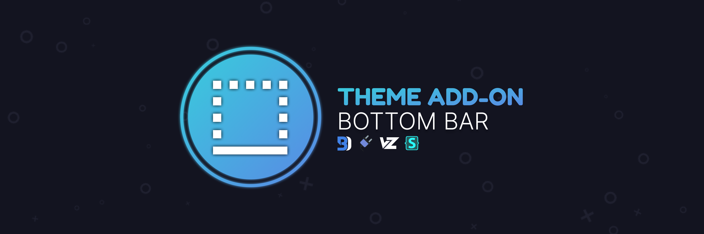
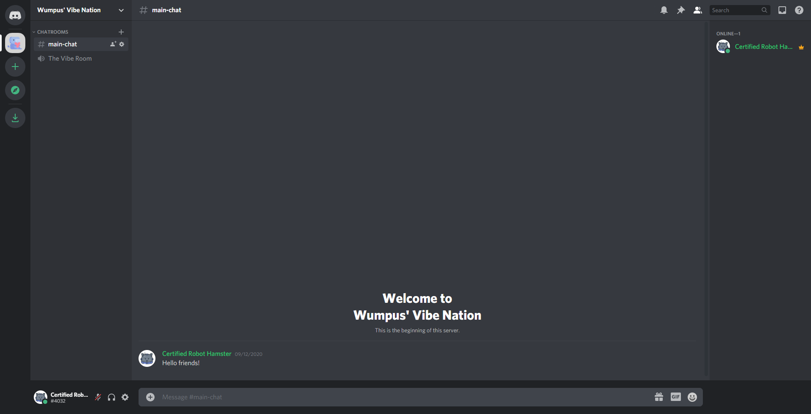

<p align="center">
  <a href="#">
  <a href="#">
  <a href="https://github.com/Discord-Theme-Addons/BottomBar/stargazers"></a>
</p>

# Bottom Bar
A nice, simple looking, bottom bar. Inspired by CapnKitten's Spotify Discord theme.



# Customization
In order to customize the colors of the bar, head over to `./src/_root.scss`, there you can mess with the variables to your liking. For variable information, peek the [variables](https://github.com/Discord-Theme-Addons/BottomBar#variables) section of this README.

# Installation
For Powercord or Vizality installation, go to **Themes -> Open a CMD / Powershell / Terminal / Gitbash** in the folder, and enter the following:
```
git clone https://github.com/Discord-Theme-Addons/BottomBar
```

**For BetterDiscord:**
- [Direct Download](https://betterdiscord.net/ghdl?id=3481)
- [View Source](https://raw.githack.com/Discord-Theme-Addons/BottomBar/main/src/support/BottomBar.theme.css)

**For Browser / Web:**
1. Install the Stylus extension for [Chrome](https://chrome.google.com/webstore/detail/stylus/clngdbkpkpeebahjckkjfobafhncgmne) / [Firefox](https://addons.mozilla.org/en-US/firefox/addon/styl-us/) / [Opera](https://github.com/openstyles/stylus/wiki/Opera,-Outdated-Stylus).
2. After installing, head over to [this link](https://raw.githack.com/Discord-Theme-Addons/BottomBar/default/src/support/BottomBar.user.css).
3. Press the "Install Style" button.

# Updating for Powercord
Since Powercord's updater is currently broken, you have to update the theme manually. In order to do this, go to **Themes -> BottomBar -> Open a CMD / Powershell / Terminal / Gitbash** in the folder, and enter the following:
```
git pull
```

# Variables
There are two variables that you can mess with.
- bar-primary, which is the primary color of the bar (aka just main color basically).
- bar-secondary, which is only used by the add server button pretty much.

# Other Support Installation (Powercord & Vizlaity Only)
If you're using [@fluffingtons'](https://github.com/fluffingtons) [Revert Discord](https://github.com/fluffingtons/revert-discord) on Powercord or Vizality and would like to use BottomBar along side it, due to compatibility issues you'll have to install a separate version. In order to do so, go to **Themes -> Open CMD / Powershell / Terminal / Gitbash**  and enter the following:
```
git clone --single-branch --branch revert-discord https://github.com/LuckFire/BottomBar
```

I will NOT be adding support for this on BetterDiscord or Web because honestly, I'm too lazy to.

## Credits 
Thank you to [@Hoofer](https://github.com/HooferDevelops) for helping me get the bottom area below the members list colored as well as finding multiple issues because I am super stupid.
